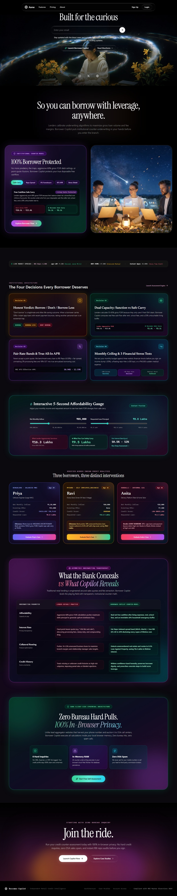
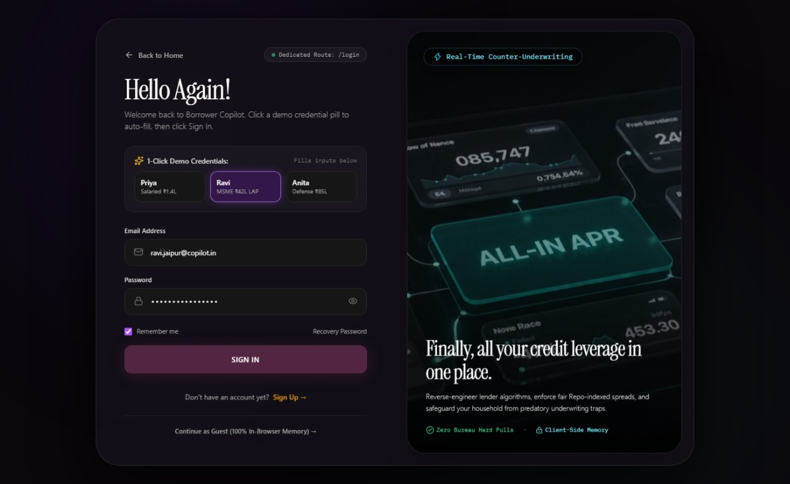
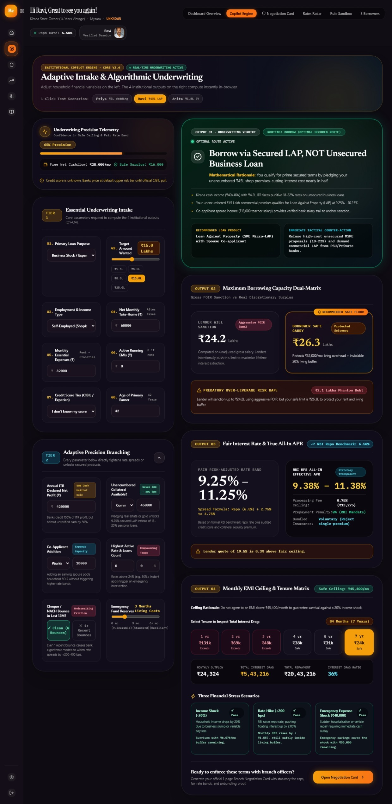
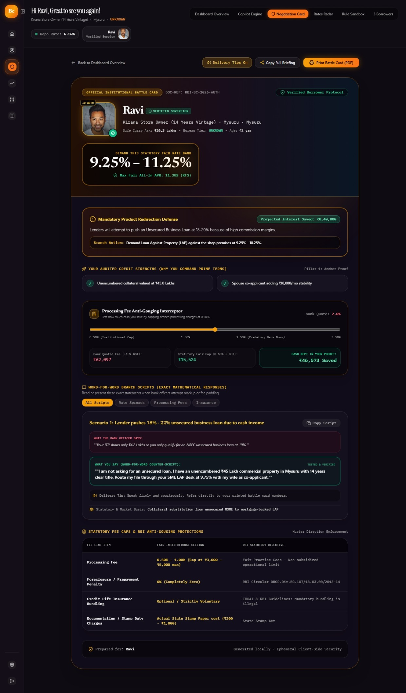
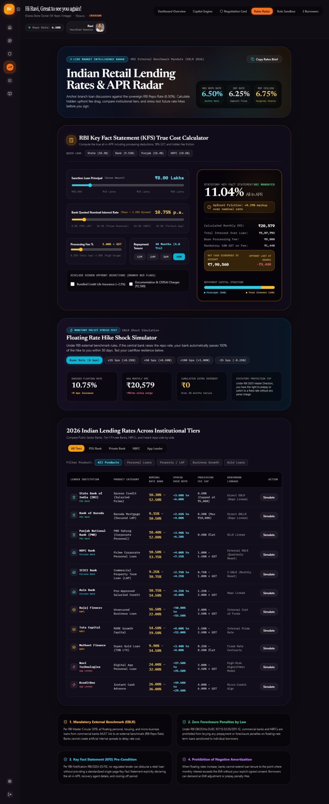
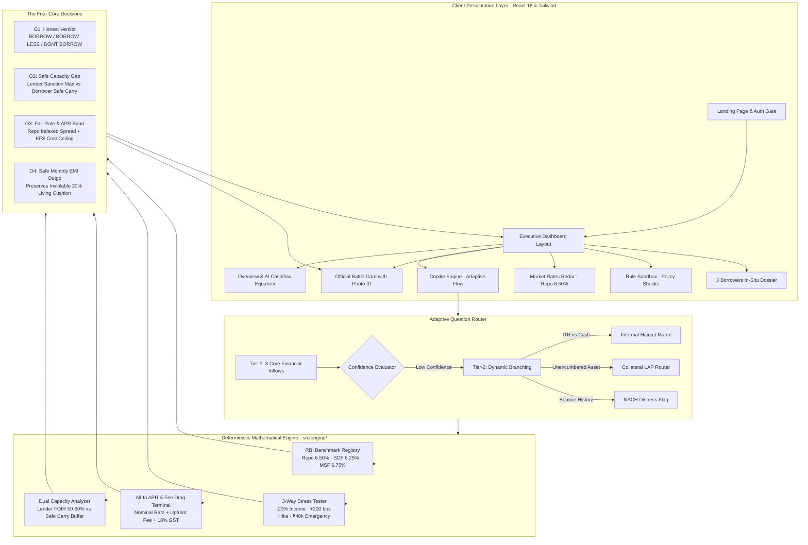

# LoanLens India 🧭
### *The Sovereign Anti-Lender Self-Assessment & Counter-Underwriting Engine for Indian Retail Borrowers*

[](https://loanlens-india.vercel.app/)
[](https://opensource.org/licenses/MIT)
[](https://reactjs.org/)
[](https://www.typescriptlang.org/)
[](https://vitejs.dev/)
[](https://tailwindcss.com/)
[](#)
[](#)
[](#)
[](#)

---

### 🌐 Live Production Deployment

> **🔗 Live URL:** **[https://loanlens-india.vercel.app/](https://loanlens-india.vercel.app/)**  
> *Deployed on Vercel with automated continuous delivery. Zero signup required. Select any 1-Click Demo Persona (Priya, Ravi, or Anita) to run counter-underwriting simulations instantly.*

---

## 📌 Executive Summary

Every commercial bank and NBFC in India operates proprietary algorithmic credit underwriting engines designed to maximize lender gross yield and fee origination. Retail borrowers typically enter bank branches blind, accept the first pre-approved sanction letter offered, and discover years later that they paid **400 basis points over fair** while stretched to **65% of their net household income**.

**LoanLens India** fundamentally levels this asymmetrical power dynamic. It acts as an **independent counter-underwriting platform** that arms Indian citizens with institutional-grade financial intelligence before they speak with a loan officer.

- **Zero Bureau Pulls:** Zero hard inquiries that damage your CIBIL/Experian score.
- **100% Ephemeral Client-Side Memory:** Zero data retention, zero database leaks, zero lead sales to DSA telecallers.
- **Sovereign RBI Regulatory Enforcement:** Strict integration with RBI Master Directions on External Benchmark Lending Rates (EBLR), Key Fact Statements (KFS April 2024), Fair Practices Code, and Microfinance Affordability Norms.

---

## 📸 Visual Platform Walkthrough & Screenshots

Below is an end-to-end visual walkthrough of LoanLens India, illustrating each layer from public intake to branch negotiation:

---

### 1. Editorial Landing Page & Sovereign Mission


> **Short Note — Public Presentation Layer:**
> - **Cinematic Hero**: Sets the sovereign counter-underwriting theme with real-time RBI Repo ticker (6.50%).
> - **Two-Column Bento Showcase**: Demonstrates the "100% Borrower Protected" paradigm with interactive feature pills (Safe Carry, Repo Spread, 0% Foreclosure, KFS APR).
> - **Interactive 5-Second Affordability Gauge**: Instant live comparison between what banks aggressively sanction vs what borrowers can safely carry.
> - **The 4 Core Decisions Preview**: Clear orientation on honest verdicts, capacity limits, fair rates, and stress testing.
> - **"What the Bank Conceals vs What Copilot Reveals"**: Complete comparative transparency table showing how bank sales quotas distort underwriting.

---

### 2. Ephemeral Authentication & 1-Click Demo Gate


> **Short Note — Zero-Retention Auth Gate (`/login`):**
> - **Zero Bureau Inquiries**: Complete security assurance that credit profiles remain 100% intact without CIBIL/CRIF footprint.
> - **1-Click Demo Personas**: Pre-loaded instant access pills for **Priya** (Salaried MNC), **Ravi** (Kirana MSME), and **Anita** (Gig Economy Delivery).
> - **In-Browser Ephemeral Session**: Password-free guest exploration option executing entirely in client-side memory.

---

### 3. Adaptive Copilot Underwriting Engine


> **Short Note — Real-Time Algorithmic Underwriting (`/dashboard`):**
> - **Two-Tier Adaptive Intake (Left)**: Tier-1 collects 8 non-negotiable cashflow metrics; Tier-2 triggers high-impact dynamic branches (ITR vs cash haircut, unencumbered collateral LAP, co-applicant additions, and NACH bounce history).
> - **The 4 Core Institutional Outputs (Right)**:
>   - **O1 Verdict**: Real-time routing verdict (`BORROW (OPTIMAL SECURED ROUTE)` for Ravi) with product redirection advice.
>   - **O2 Capacity Dual-Matrix**: Direct comparison between Lender Sanction Max (₹24.2L) vs Borrower Safe Carry (₹26.3L).
>   - **O3 Fair Rate & KFS APR**: Direct sovereign spread formula (**9.25% – 11.25%** with 11.38% All-In KFS APR).
>   - **O4 Safe Monthly EMI Outgo**: 7-year tenure selector ensuring outgo stays under safe cashflow ceiling, coupled with 3-scenario stress testing (-20% Income Slump, +200 bps Rate Hike, ₹40,000 Emergency Shock).

---

### 4. Official Negotiation Battle Card with Verified Photo ID


> **Short Note — Branch Negotiation Shield (`/card`):**
> - **Verified Borrower Portrait Frame**: Features the borrower's authentic portrait (`ID-AUTH`) in an illuminated institutional frame with sovereign verification badges.
> - **Target Fair Rate Anchor**: Bold, undeniable statutory demand box (**9.25% – 11.25%**, Max Fair APR: 11.38%).
> - **Mandatory Product Redirection Defense**: Prominently highlights **₹8,40,000 projected interest saved** by avoiding high-commission unsecured business loans.
> - **Processing Fee Anti-Gouging Interceptor**: Interactive slider showing exact rupees saved by enforcing the statutory 0.50% fee ceiling.
> - **Word-for-Word Branch Counter-Scripts**: Scenario-based conversational scripts with legal citations and audio delivery tips.
> - **Print Battle Card (PDF)**: High-resolution print styling formatted for physical presentation to bank branch managers.

---

### 5. Indian Retail Lending Rates & APR Radar


> **Short Note — Institutional Rate Intelligence Terminal (`/radar`):**
> - **Live Central Bank Benchmark**: Active RBI Repo Rate at **6.50%**, Standing Deposit Facility (SDF **6.25%**), and Marginal Standing Facility (MSF **6.75%**).
> - **RBI Key Fact Statement (KFS) True Cost Calculator**: Interactive sliders for loan amount, nominal rate, fee %, and tenure. Computes real All-In APR with 18% GST and unmasks predatory bundled insurance drag.
> - **Floating Rate Hike Shock Simulator**: Stress-tests future RBI MPC rate decisions (+25 bps, +50 bps, +100 bps shock, -25 bps cut) showing exact monthly EMI changes and cumulative interest burden.
> - **2026 Card Rates Comparative Matrix**: Filterable comparison across PSU Banks (SBI, BoB, PNB), Tier-1 Private Banks (HDFC, ICICI, Axis), NBFCs (Bajaj, Tata Capital, Muthoot), and Fintech Apps (Navi, KreditBee) with 1-click simulation buttons.
> - **The 4 Statutory Rate Defense Principles**: Authoritative summary of EBLR linkage, 0% foreclosure penalties, mandatory KFS, and negative amortization prohibitions.

---

## 🏛️ System Architecture Diagram

### 1. Interactive Flow & Decision Graph (Mermaid)



---

### 2. High-Level Modular Layering (ASCII)

```
┌─────────────────────────────────────────────────────────────────────────────────────────────┐
│                                CLIENT PRESENTATION LAYER                                    │
│  [ Instrument Serif / Instrument Sans / IBM Plex Mono ]  •  [ Dark Obsidian ]  •  [ Mobile ]│
├─────────────────────────────────────────────────────────────────────────────────────────────┤
│   Landing Page   │   2-Tier Questionnaire   │   4 Core Outputs   │   Branch Battle Card     │
│   Auth & Routing │   Live Dynamic Sliders   │   O1, O2, O3, O4   │   Verified Avatar & ID   │
└──────────────┬──────────────────────────────┴───────────┬───────────────────────────────────┘
               │                                          │
               ▼                                          ▼
┌─────────────────────────────────────────────────────────────────────────────────────────────┐
│                                ADAPTIVE QUESTION ROUTER                                     │
│  Tier-1: Must Questions (8 Core) ─────────────► Confidence Meter (Wide / Low Confidence)     │
│  Tier-2: High-Impact Dynamic Branches ────────► Precision Tuning (Narrows Spreads & Bounds) │
│          • ITR vs Cash Haircut                   • Unencumbered Asset Collateral (LAP)      │
│          • Co-Applicant Banking Trail            • 12-Month Bounce History                  │
│          • Productive Asset Cashflow             • Highest Existing Loan Rate (Usury Check) │
└──────────────────────────────────────────────┬──────────────────────────────────────────────┘
                                               │
                                               ▼
┌─────────────────────────────────────────────────────────────────────────────────────────────┐
│                          ISOLATED DOMAIN MATHEMATICAL ENGINE (src/engine/)                   │
│                                                                                             │
│  ┌──────────────────────────┐  ┌──────────────────────────┐  ┌───────────────────────────┐  │
│  │   BENCHMARK REGISTRY     │  │  DUAL CAPACITY ANALYZER  │  │   RISK PRICING & APR      │  │
│  │ • RBI Policy Repo: 6.50% │  │ • Lender Gross FOIR Max  │  │ • Risk Spread Formula     │  │
│  │ • Commercial LAP: 50% LTV│  │ • Real Free Cashflow     │  │ • 0.50% Fair Statutory Cap│  │
│  │ • Residential: 75% LTV   │  │ • 20% Living Buffer Cap  │  │ • 18% GST Annualized Drag │  │
│  │ • MFI Debt Cap: 50%      │  │ • Discretionary Pruning  │  │ • RBI KFS Effective APR   │  │
│  └──────────────────────────┘  └──────────────────────────┘  └───────────────────────────┘  │
│                                              │                                              │
│                                              ▼                                              │
│  ┌───────────────────────────────────────────────────────────────────────────────────────┐  │
│  │                          3-SCENARIO FINANCIAL STRESS ENGINE                           │  │
│  │  [ Shock 1: -20% Income Slump ]  [ Shock 2: +200 bps Rate Hike ]  [ Shock 3: ₹40k Med ]  │  │
│  └───────────────────────────────────────────────────────────────────────────────────────┘  │
└──────────────────────────────────────────────┬──────────────────────────────────────────────┘
                                               │
                                               ▼
┌─────────────────────────────────────────────────────────────────────────────────────────────┐
│                               FOUR STANDARDIZED CORE OUTPUTS                                │
│                                                                                             │
│   [O1: The Honest Verdict]       [O2: Capacity Numbers]      [O3: Fair Rate & APR]          │
│   • BORROW                       • Lender Sanction Max       • Fair Rate Band (Min-Max)     │
│   • DONT BORROW                  • Borrower Safe Carry       • Key Fact Statement APR       │
│   • BORROW LESS                  • Safe Borrowing Gap (L)    • Upfront Fee Cap (Statutory)  │
│                                                                                             │
│   [O4: Monthly Cashflow Outgo]   [Tactical Branch Shield]    [Pre-Closing Battle Card]      │
│   • Safe EMI Ceiling             • Word-for-Word Scripts     • Verified Borrower ID         │
│   • 20% Living Floor Cushion     • Product Redirection Alert • Printable PDF Format         │
└─────────────────────────────────────────────────────────────────────────────────────────────┘
```

---

## ⚡ Quickstart (Under 30 Seconds)

### 1. Clone & Install
```bash
# Clone the repository
git clone https://github.com/Reethikaa05/LoanLens-India.git
cd LoanLens-India

# Install dependencies
npm install
```

### 2. Run Development Server
```bash
npm run dev
```
Open **`http://localhost:3000`** in your browser to experience the platform.

### 3. Run Automated Domain Invariant Tests
```bash
npm test -- --run
```
Verifies mathematical domain invariants across Priya, Ravi, and Anita test cases.

### 4. Build for Production
```bash
npm run build
```
Produces an optimized, minified bundle in the `dist/` directory.

---

## 🎯 The Four Standardized Core Outputs

| Output Symbol | Metric Name | Definition & Consumer Defense |
| :--- | :--- | :--- |
| **O1** | **The Honest Verdict** | Categorical decision: `BORROW`, `BORROW LESS`, or `DONT BORROW`. Never incentives debt when structural failure is detected. |
| **O2** | **Safe Borrowing Gap** | Direct comparison between **Lender Sanction Max** (calculated on gross FOIR) vs **Borrower Safe Carry** (derived from free cashflow). |
| **O3** | **Fair Pricing & APR Band** | Statutory rate band anchored to the **RBI Repo Rate (6.50%)** plus fair risk spread, disclosing all-in APR with 18% GST and upfront fee drag. |
| **O4** | **Safe Monthly EMI Outgo** | The hard rupee limit on total monthly debt outgo that guarantees an inviolable **20% living buffer** and preserves household liquidity. |

---

## 👥 The Three Canonical Indian Case Archetypes

LoanLens India tests every algorithmic decision against three real-world Indian borrower archetypes:

### 1. Priya (Bengaluru) · Salaried MNC Engineer
- **Profile:** Net income ₹1,10,000/mo, CIBIL 780, existing car EMI ₹14,000, wedding ask ₹8,00,000.
- **The Trap:** Bank pushes **₹20.31 Lakhs** at 14.0% p.a., consuming 51% of her salary for a 1-day wedding.
- **Copilot Action:** Enforces `BORROW LESS`. Restricts discretionary borrowing to **₹4.95 Lakhs** (4x monthly income) and demands prime corporate salaried rates (10.50% - 11.75%).

### 2. Ravi (Mysuru) · 14-Year Kirana Merchant
- **Profile:** Cash-heavy income ₹60,000/mo, zero CIBIL history, ₹15,00,000 ask for inventory & delivery van.
- **The Trap:** NBFC agents push an **Unsecured Business Loan at 19.5%** with ₹53,100 upfront fees to maximize commission.
- **Copilot Action:** Enforces `BORROW`. Detects Ravi's **₹45 Lakh unencumbered commercial shop** and redirects him to **Secured LAP at 9.25% - 10.25%**, saving **₹8,40,000 in interest**.

### 3. Anita (Hubballi) · Gig Economy Delivery Partner
- **Profile:** Net income ₹28,000/mo, multiple 32-36% instant app loans, 1 recent NACH bounce, ₹1.5L EV scooter ask.
- **The Trap:** Digital fintech apps offer instant credit rollover, creating a compounding debt spiral exceeding 65% of her income.
- **Copilot Action:** Enforces `DONT BORROW`. Triggers hard stop on unsecured personal borrowing. Prescribes debt consolidation and redirects EV financing to **Pradhan Mantri Mudra Yojana (PMMY Shishu)**.

---

## ⚖️ Statutory RBI Regulations Enforced

1. **Mandatory External Benchmark Lending Rate (EBLR):**
   - *Reference:* RBI Circular RBI/2019-20/54.
   - All floating retail and MSME loans must link to an external benchmark (Repo Rate 6.50%). Banks cannot hide rate cuts.
2. **Zero Foreclosure & Prepayment Penalty:**
   - *Reference:* RBI Circular DBOD.No.Dir.BC.107/13.03.00/2011-12 & RBI/2019-20/38.
   - Lenders cannot penalize individual retail borrowers for prepaying or foreclosing floating-rate loans.
3. **Mandatory Standardized Key Fact Statement (KFS):**
   - *Reference:* RBI Notification RBI/2024-25/112 (April 2024).
   - Lenders must provide a 1-page standardized KFS before sanction disclosing the exact all-in APR, recovery agents, and cooling-off period.
4. **Prohibition of Negative Amortization:**
   - *Reference:* RBI Circular DOR.MCS.REC.32/01.01.001/2023-24.
   - Lenders cannot extend tenure upon rate hikes so far that monthly interest exceeds EMI without explicit consent.

---

## 🛠️ Technology Stack

- **Framework:** React 18 with TypeScript
- **Bundler:** Vite 5.4 (sub-second HMR and production minification)
- **Styling:** Tailwind CSS 3.4 with custom dark obsidian palette (`#0E0B12`, `#120D1A`) and typography (`Instrument Serif`, `Newsreader`, `IBM Plex Mono`)
- **Icons:** Lucide React
- **Testing:** Tsx test runner with mathematical domain invariant assertions
- **Privacy:** 100% In-Browser Client-Side Evaluation (zero network telemetry)

---

## 📄 License & Attribution

Distributed under the **MIT License**. Created for the citizens and retail borrowers of India to counter structural financial asymmetry.
